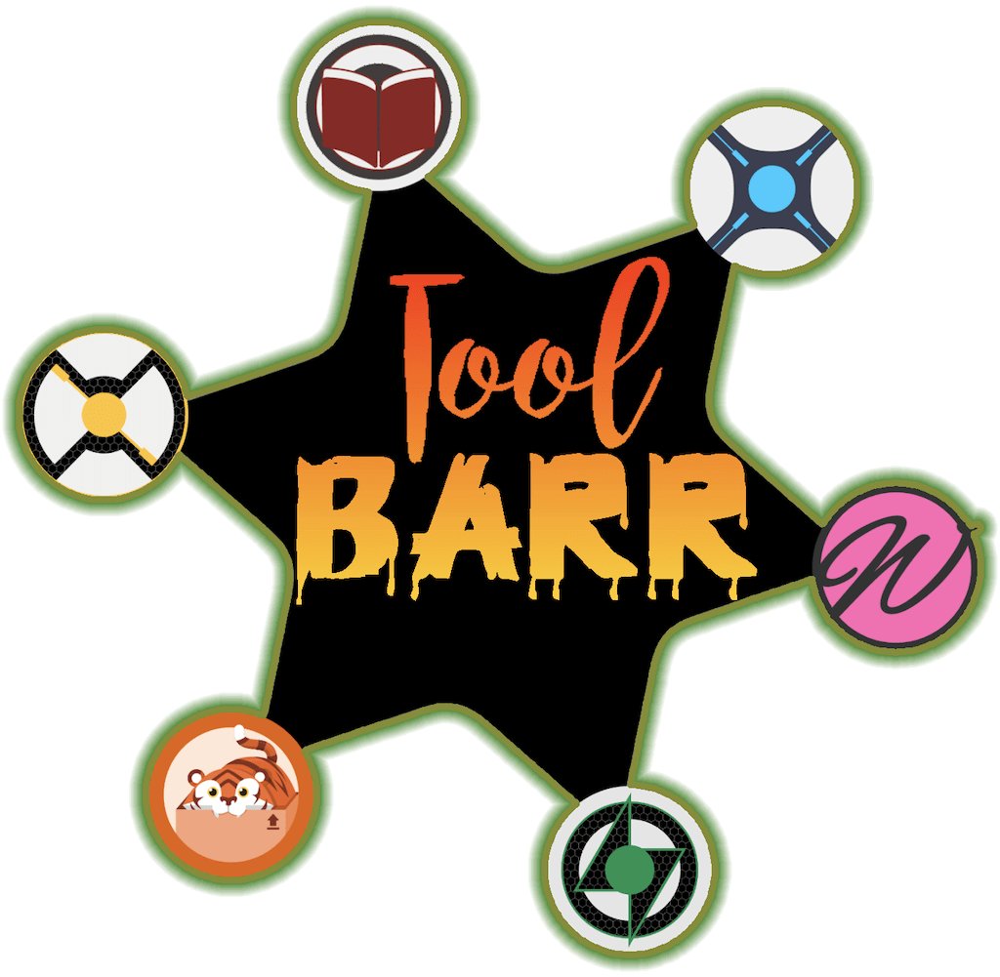

# 

Provides a suite of utilities to fix problems with Starr applications.
Toolbarr allows you to perform various actions against your Starr apps and their SQLite3 databases.

# Features

The first release provides 1 major feature:

- **Updating Root Folders**: Use this when you need to
[migrate your starr application](https://github.com/Notifiarr/toolbarr/wiki/Change-Root-Folder)
to another host, and the file system paths to your media are changing.

And several other features:

- Mass Quality Profiles management.
- Mass Indexer management.
- Mass Import List management.
- Mass Import List Exclsions management.
- Mass Download Client management.
- Mass Block List management.

# How?

Run this application on _your_ computer (mac/windows).
Configure it with your starr app details (url/api key), and an optional sqlite3 database file.

# Installation

~~There's a DMG for mac users and an EXE installer for Windows users on the
[Releases](https://github.com/Notifiarr/toolbarr/releases) page.
Download the latest file for your OS and install it. Once installed,
you can use the `About` menu to check for updates.~~

**While things are under development, grab a copy of the Windows or macOS installer
@ [https://unstable.golift.io/toolbarr](https://unstable.golift.io/toolbarr)**

Linux users may not have great luck with the binaries provided.
They only work on a specific version of `glibc`.
Prepare to compile it yourself, but you can try installing it from the repo first:

```shell
curl -s https://golift.io/repo.sh | sudo bash -s - toolbarr
```

# Caution

This app may be destructive. Make backups. Do not connect it to a live SQLite database file; use a backup copy!

The `Actions` tab is safe, and well tested with the four primary Starr apps.
Prowlarr has limited support. Whisparr may work, but is not tested.

# I want more..

We do too. What other things do you want to do Sonarr or Radarr that you just can't do easily some other way?
**This is a work in progress and your input will make it work better!**

- [Let us know how we can make your life easier](https://github.com/Notifiarr/toolbarr/issues/new).